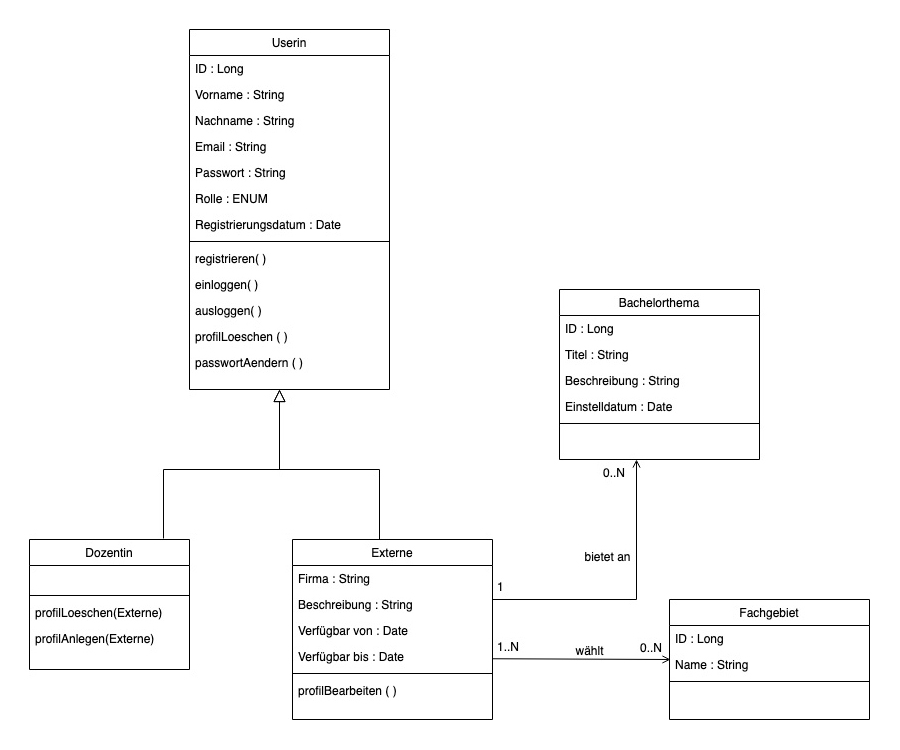
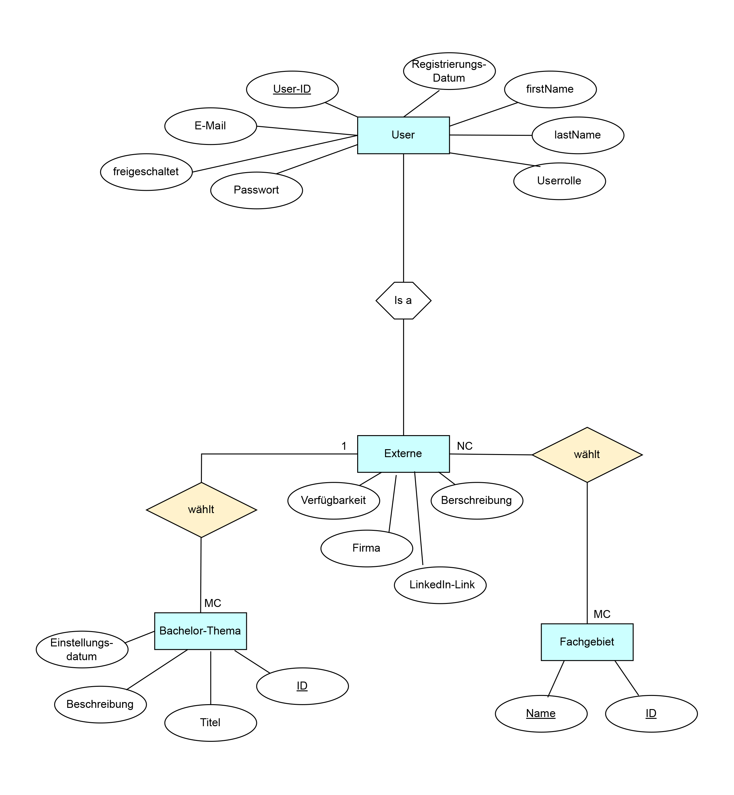

# Projekt CleverConnect

## Technologien
Im Rahmen des Projekts verwendete Technologien

* **Java**: Version 21
* **Spring Boot**: Ein Framework zur Vereinfachung der Erstellung von Spring-Anwendungen. Version 3.1.5 
* **Maven**: Ein Werkzeug zur Verwaltung und zum Bau von Java-Projekten. Die Version wird durch Version von Spring Boot bestimmt.
* **PostgresSQL**: Die Datenbank, die für die Speicherung der Daten verwendet wird.
* **JPA/Hibernate**: Ein Framework zur Abbildung von Java-Objekten auf relationale Datenbanken. Die Version wird durch Version von Spring Boot bestimmt.
* **OpenAPI/Swagger**: in Werkzeug zur Erstellung von API-Dokumentationen. Version 2.3.0


## Projekt lokal ausführen

Um dieses Projekt lokal auszuführen, führen Sie die folgenden Schritte aus:

1. Projekt klonen: 
```
$ git clone https://gitlab.htw-berlin.de/Sabine.Matthies/team-c-backend
```
2. In das Projektverzeichnis wechseln: 
```
$ cd ../path/to/the/file
```
3. Abhängigkeiten installieren: 
```
$ mvn install
```
4. Anwendung starten:
```
$ mvn spring-boot:run
```
Das Projekt wird nun auf http://localhost:3000 gestartet.


### Datenbank

## Details zum Projekt

### UseCase Diagramm


### Klassendiagramm



### Datenbankentwurf


### PostgresSQL-Datenbank anlegen

Erstellen der Tabellen


>>> Muss geprüft werden!
>>> Create User table fehlt
>>> liber Pdf/Bild einfügen, für bessere Übersicht

```
CREATE TABLE Externals  
    (id                 SERIAL PRIMARY KEY,  
     first_name         VARCHAR(30),
     last_name          VARCHAR(30),
     email              VARCHAR(100) UNIQUE NOT NULL,
     password           VARCHAR(255) NOT NULL,
     role               VARCHAR(10) CHECK (role IN ('ADMIN', 'STUDENT', 'EXTERN')),
     locked             BOOLEAN,
     enabled            BOOLEAN,
     registration_date  DATE,
     company            VARCHAR(50),
     availability_start DATE,
     availability_end   DATE,
     description        VARCHAR(255));

CREATE TABLE Bachelor_Subject
    (id                 SERIAL PRIMARY KEY,
     title              VARCHAR(255),
     b_description      VARCHAR(255),
     date               DATE,
     external_id        SERIAL,
     FOREIGN KEY (external_id) REFERENCES Externals(id) ON DELETE CASCADE);


CREATE TABLE Special_Field
	(id             SERIAL PRIMARY KEY,
	name            VARCHAR(255) NOT NULL);

CREATE TABLE choosen_fields
	(external_id    SERIAL,
	special_field_id SERIAL,
	PRIMARY KEY (external_id, special_field_id),
	FOREIGN KEY (external_id) REFERENCES Externals(id) ON DELETE CASCADE,
	FOREIGN KEY (special_field_id) REFERENCES Special_Field(id) ON DELETE CASCADE);
```


### Dokumentation der Endpunkte

Alle Endpunkte wurden mit OpenAPI dokumentiert.  
Wenn die Anwednung ausgeführt wird, kann die Dokumentation hier aufgerufen werde:   

[Swagger UI](http://localhost:3000/swagger-ui/index.html#/)

Im Projekt wurde ein Endpunkt zum Aufrufen der Dokumentation implementiert.   
Folgender Endpunkt leitet zur Swagger UI Dokumentation der API um:  

[GET /user/swagger (localhost:3000/user/swagger)](localhost/user/swagger)


